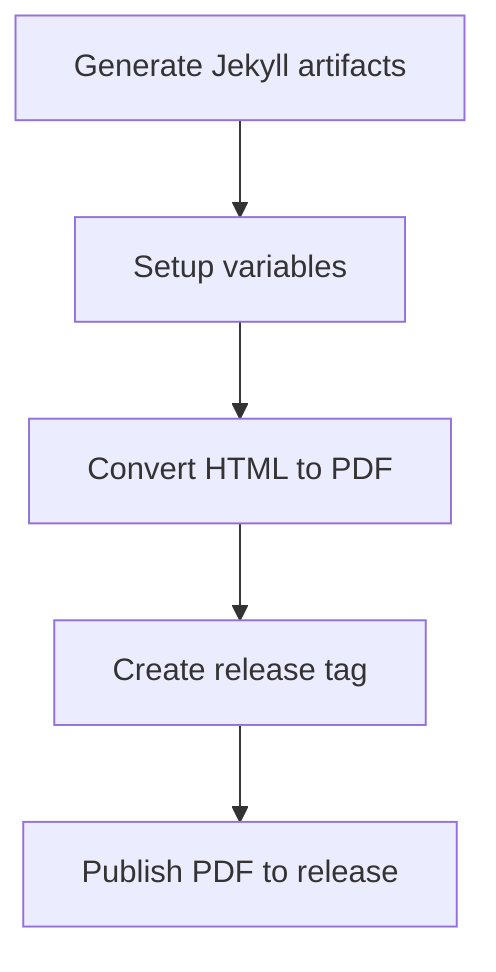

# CV Project Context

**Project Type:** Markdown-based CV Generator using Jekyll + GitHub Pages  
**Purpose:** Technical documentation for project architecture and workflows

---

## 📋 Project Overview

A **markdown-based CV generator** using Jekyll static site generator, deployed via GitHub Pages with automated PDF generation pipeline. The project enables maintaining a professional CV in simple markdown format with multiple customizable templates and automated publishing workflows.

**Key Features:**
- ✍️ Markdown-based CV editing
- 🎨 Multiple CSS templates (kjhealy, davewhipp)
- 📄 Automated PDF generation via GitHub Actions
- 🚀 GitHub Pages deployment
- 🐳 Docker-based local development
- 🔒 Optional private builds with sensitive data

---

## 🏗️ Project Structure

```
cv/
├── .github/
│   └── workflows/
│       └── publish-pdf.yml        # PDF generation & release pipeline
├── _layouts/
│   └── cv.html                    # Jekyll layout template
├── media/
│   ├── kjhealy-screen.css         # Screen template (default)
│   ├── kjhealy-print.css          # Print template
│   ├── davewhipp-screen.css       # Alternative screen template
│   └── davewhipp-print.css        # Alternative print template
├── _config.yml                    # Jekyll config (markdown engine, style)
├── index.md                       # Main CV content (MARKDOWN)
├── Gemfile                        # Ruby dependencies (Jekyll)
├── docker-compose.yml             # Local development setup
└── README.md                      # Comprehensive user-facing documentation (504 lines)
```

---

## 🚀 How to Run Locally

### Option 1: Docker (Recommended)
```bash
# Start Jekyll server
docker-compose up -d

# Verify server is running
curl http://localhost:4000

# Access at http://localhost:4000
# Auto-reload on file changes (~20s delay)

# Stop server
docker-compose down
```

### Option 2: Ruby Server (Alternative)
```bash
# Install dependencies (first time only)
bundle install

# Start Jekyll server
bundle exec jekyll serve

# Verify server is running (in new terminal)
curl http://localhost:4000

# Access at http://localhost:4000
# Auto-reload on file changes

# Stop with Ctrl+C
```

**Note:** Changes to `_config.yml` require container/server restart.

---

## 🌐 Deployment & Branch Management

### Branch Strategy
- **`main`** - Primary development branch (protected)
- **`page-release`** - GitHub Pages deployment branch (protected)
- **Feature branches** - Active development (e.g., `feat/add-section`, `fix/typo`)

> [!WARNING]
> **Core Team:** Never commit directly to `main` or `page-release`! Always create a feature branch and submit a pull request.
> **Fork Users:** You may commit directly to your `main` or `page-release` branches since you are the owner of your fork.

### Recommended Workflow (Core Team)
1. Check current branch: `git branch`
2. Use `/git-branch-pr` workflow to create feature branch and PR
3. Make changes and verify locally (using `curl` or browser)
4. Commit changes via workflow
5. Merge PR after review

**See `/git-branch-pr` workflow for detailed step-by-step guidance.**

### GitHub Pages Deployment
1. **Automatic:** Push to `page-release` triggers GitHub Pages build
2. **URL Format:** `https://[username].github.io/[repo-name]`
3. **Configuration:** Settings > Pages > Branch: `page-release`
4. **Deployment:** Merge PR from feature branch → main → page-release

> [!TIP]
> See the [main README.md](file:///mnt/c/workspace/ai-workspace/cv/README.md) Quick Start section for detailed step-by-step guide with visual workflows for fork users.

---

## 📄 PDF Generation Pipeline

**File:** `.github/workflows/publish-pdf.yml`  
**Trigger:** Manual workflow dispatch or scheduled (monthly - currently disabled)

### Workflow Steps


### Pipeline Features

#### 1. Public Build (Default)
- Creates PDF from `index.md`
- Generates GitHub Release with tag: `PDF_YYYYMMDD-[timestamp]`
- Publishes PDF as release asset
- **Release Notes:** Required input field

#### 2. Private Build (Optional)
- Checkbox: "Build privately & include sensitive data"
- Injects phone number from `secrets.CV_PHONE_NUMBER`
- PDF stored in artifacts (48-hour retention)
- No public release created

### Required Secrets
- `CV_PHONE_NUMBER` - For private builds (Settings > Secrets > Actions)

---

## 🎨 Templating System

### How It Works
1. **Jekyll Layout:** `_layouts/cv.html` defines HTML structure
2. **CSS Templates:** Located in `media/` directory
3. **Template Selection:** Controlled by `_config.yml`

### Current Templates
- **kjhealy** (default) - Two-column layout, minimalist design
- **davewhipp** - Alternative styling

### Template Structure
Each template has two files:
- `[template]-screen.css` - For web display
- `[template]-print.css` - For PDF generation

### Switching Templates
Edit `_config.yml`:
```yaml
markdown: kramdown
style: kjhealy  # Change to 'davewhipp' or custom template name
```

### Template Anatomy
```html
<!-- _layouts/cv.html -->
<head>
  <link href="media/{{ site.style }}-screen.css" media="screen">
  <link href="media/{{ site.style }}-print.css" media="print">
</head>
<body>
  {{ content }}  <!-- index.md content injected here -->
</body>
```

---

## 📝 CV Structure & Sections

### Single Source of Truth
**IMPORTANT:** All CV content lives in `index.md` - this is the only file containing CV data. All workflows and updates modify this file directly. No separate markdown files are created for CV content.

### YAML Front Matter
```yaml
---
layout: cv
title: Your Name
---
```

### Main Sections (in order)
1. **Header** - Name, title, contact info
2. **Profile Summary** - Professional overview
3. **Technical Skills** - Technology stack
4. **Professional Experience** - Job history (reverse chronological)
5. **Education** - Academic background
6. **Activities** - Publications, certifications, projects
7. **Language** - Language proficiency

### Section Formatting Patterns

#### Professional Experience
```markdown
`StartDate - EndDate`
__Position__, Company Name

Description paragraph

- 1) Achievement with **metrics** in bold
- 2) Another achievement
```

#### Education
```markdown
`StartYear - EndYear`
__Institution, Location__

Degree details, GPA
```

#### Activities (Medium Articles)
```markdown
`MonthYear`
[**Article Title**](url)

Metrics/reach information
```

### Special Elements
- **Date ranges:** Inline code blocks \`StartDate - EndDate\`
- **Emphasis:** Bold for metrics, underline for positions/institutions
- **Page breaks:** `<div style="page-break-after: always;"></div>`
- **Contact info:** `<div id="webaddress">` for styling hooks

---

### LinkedIn Integration

### LinkedIn Profile URL
**Location:** `index.md` webaddress section  
**Format:** `<a href="https://linkedin.com/in/[username]">linkedin.com/in/[username]</a>`

### URL Extraction Methods
1. **Automatic:** Parse from `index.md` line 12
2. **Manual:** User provides URL directly during workflow execution

### Fetchable Data from LinkedIn
The profile contains valuable information that can be extracted:
- Professional experience (titles, companies, dates, descriptions)
- Education credentials
- Skills and endorsements
- Certifications with dates
- Projects and descriptions
- Publications and articles

### Integration Notes
- LinkedIn URL is automatically extracted from `index.md` when using `/add-cv-section` workflow
- User can override with different LinkedIn profile URL if needed
- Browser automation may require authentication
- Respect LinkedIn's Terms of Service and rate limits
- Extracted data is inserted into `index.md` (single source of truth)

---

## 🛠️ Technology Stack

- **Static Site Generator:** Jekyll (Ruby)
- **Markdown Engine:** Kramdown
- **Templating:** Liquid (Jekyll)
- **CI/CD:** GitHub Actions
- **Containerization:** Docker
- **PDF Generation:** html2pdf (GitHub Action)
- **Hosting:** GitHub Pages

---

## 🔄 Common Workflows

### Update CV Content
1. Edit `index.md` on `main` branch
2. Test locally: `docker-compose up -d`
3. Commit and push changes
4. Merge to `page-release` for web deployment
5. Run "Build PDF" action for PDF release

### Add New Template
1. Create `media/[name]-screen.css`
2. Create `media/[name]-print.css`
3. Update `_config.yml`: `style: [name]`
4. Test locally before committing

### Generate PDF
1. Go to Actions > Build PDF
2. Click "Run workflow"
3. Enter release notes
4. Check "private build" if including phone number
5. Download from Releases or Artifacts

---

## 🎯 Custom Commands Available

### 1. Add CV Section
**Command:** `/add-cv-section`  
**Purpose:** Interactively add new sections to `index.md` (single source of truth)

**Features:**
- Updates `index.md` directly
- Manual data entry or LinkedIn fetch
- LinkedIn URL auto-extracted from `index.md` line 12
- Automatic formatting per CV structure
- Section validation
- Local preview option
- Git workflow guidance (no auto-commit)

**Supported Sections:**
- Professional Experience
- Education
- Activities (Articles/Certifications)
- Projects
- Custom sections

---

### 2. Generate Template
**Command:** `/generate-template`  
**Purpose:** Create new CSS templates for CV styling

**Features:**
- Creates `media/[name]-screen.css` and `media/[name]-print.css`
- Reference URL input
- Description-based generation
- Hybrid approach (URL + customization)
- Template testing with Docker or Ruby server
- PDF generation validation
- Documentation creation
- Auto-registration in `_config.yml`

**Note:** This is the only workflow that creates new files (CSS templates), not CV content files.

---

### 3. Git Branch & PR Workflow
**Command:** `/git-branch-pr`  
**Purpose:** Guide through proper git workflow with feature branches and pull requests

**Features:**
- Branch creation with naming conventions
- Checks for existing pull requests
- Creates or updates PRs
- Prevents direct commits to protected branches
- Merge guidance after approval
- Cleanup after merge

**Protected Branches:** `main`, `page-release`

> [!IMPORTANT]
> AI agents will never auto-commit. All git commits require explicit user approval.

---

## 📌 Important Notes

### Git Workflow
- **Always use feature branches** (never commit directly to `main` or `page-release`)
- Create PRs for all changes using `/git-branch-pr` workflow
- Merge feature branches to `main` for staging
- Merge `main` to `page-release` for deployment
- AI agents must ask for approval before any git commit

### Pipeline Permissions
- Workflow needs `write-all` permissions
- Configured in `publish-pdf.yml`

### Local Development
- **Docker (recommended):** `docker-compose up -d`
- **Ruby server (alternative):** `bundle exec jekyll serve`
- Jekyll auto-reloads on `.md` file changes (~20s for Docker, faster for Ruby)
- Config changes require restart
- Port 4000 by default (customizable in docker-compose.yml)

### Sensitive Data
- Phone number stored in GitHub Secrets
- Private builds expire after 48 hours
- Never commit sensitive data to repo

---

## 🐛 Known Issues & Limitations

1. **Jekyll reload delay:** ~20 seconds for local changes
2. **Config changes:** Require container restart
3. **PDF generation:** Relies on third-party GitHub Action
4. **LinkedIn scraping:** May require authentication

---

## 📚 References

- **Original Inspiration:** https://github.com/elipapa/markdown-cv
- **Jekyll Documentation:** https://jekyllrb.com/
- **GitHub Pages:** https://docs.github.com/en/pages
- **Kramdown Syntax:** https://kramdown.gettalong.org/

---

## 🎓 Learning Resources

### Understanding the Pipeline
1. Review `.github/workflows/publish-pdf.yml`
2. Study Jekyll build process
3. Examine HTML to PDF conversion
4. Explore GitHub Actions artifacts

### Customizing Templates
1. Study existing CSS files in `media/`
2. Learn Jekyll Liquid templating
3. Understand print vs screen media queries
4. Test with browser DevTools

### Markdown Best Practices
1. Use consistent heading hierarchy
2. Leverage inline code for dates
3. Bold important metrics
4. Maintain readable line length

---

_This context document is maintained by AI agents and should be updated as the project evolves._
