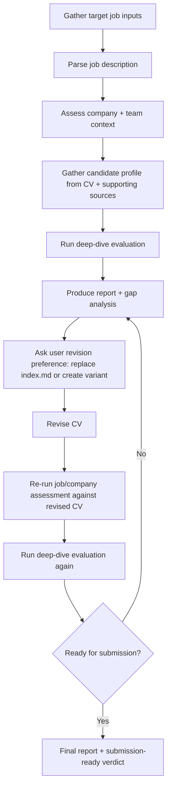

# Iterative CV Optimization Workflow

**Purpose:** Guide an AI agent through a repeatable, job-targeted CV optimization cycle. The workflow starts from the user's target job and supporting resources, builds a company/job understanding, evaluates the current CV deeply, proposes and applies improvements, then repeats the evaluation loop until the CV is strong enough for submission.

> [!TIP]
> **When to use this workflow:**
>
> Use this workflow when the user wants to optimize a CV for a specific job, company, or role and expects multiple evaluation/revision rounds rather than a one-off review.

## Important Notes
- **Primary evaluation engine:** This workflow depends on `.agents/workflows/evaluate-cv-deepdive.md` and `.agents/references/cv-evaluation-framework.md`
- **Default CV source:** `index.md` remains the default source of truth unless the user explicitly asks for a job-specific variant
- **Variant support:** If the user prefers a separate tailored version, the agent may create a new markdown CV file instead of editing `index.md`
- **Reports required:** Each major evaluation round should produce a saved report (HTML preferred when appropriate)
- **Iteration stop condition:** Continue until the assessment is high enough and the agent can confidently say the CV is ready for submission, or until the user chooses to stop

---

## Workflow Overview



---

## Workflow Steps

### Step 1: Gather Target Job Inputs

Ask the user for the minimum required inputs:

```text
To optimize your CV for a specific application, please provide:

1. The target job title and company (if known)
2. The job description source:
   - PDF file path
   - URL
   - pasted text
   - any other supporting document
3. Optional supporting resources for your profile:
   - branding-context folder
   - portfolio/resume files
   - LinkedIn / portfolio URLs
   - project notes or interview prep docs
4. Whether you want the revision to:
   - replace index.md
   - or create a separate tailored CV file
```

If any of the above is unclear, clarify one item at a time before proceeding.

---

### Step 2: Ingest and Parse the Job Description

Accept any of these JD inputs:
- PDF
- Markdown/text document
- pasted description
- URL

**Process:**
1. Read the JD completely
2. Extract:
   - job title
   - company name
   - role scope
   - must-have requirements
   - preferred / bonus requirements
   - technical keywords
   - collaboration / culture signals
   - language / location requirements

If the company name appears in the JD, treat company research as mandatory in Step 3.

Present confirmation:

```text
Job target assessment scope:
- Role: [job title]
- Company: [company name]
- JD source: [file/url/text]
- Key requirement groups identified: [summary]

Proceeding to company and team assessment...
```

---

### Step 3: Assess Company, Team, and Role Context

If the company is known, research the company as part of job-description assessment.

**Research goals:**
1. Company profile and core business
2. Relevant product/business unit tied to the role
3. Team/division related to the JD
4. Team size or org scale (if discoverable)
5. Engineering culture / values / hiring signals
6. Product stage and operational challenges
7. Any specific technical stack or tooling signals
8. Anything that affects how the CV should be positioned

**Examples of useful findings:**
- Company mission / culture values
- Team/org maturity
- Product scale and reliability expectations
- Whether AI/ML is central, adjacent, or irrelevant to the role
- Whether the company values platform ownership, collaboration, speed, or experimentation

**Output required:**
Create a structured company/job assessment that supplements the JD rather than replacing it.

---

### Step 4: Gather Candidate Profile from All Relevant Sources

Read the current CV and any additional sources the user provides.

**Minimum sources:**
1. Current target CV source (`index.md` by default, or user-specified variant)

**Optional supporting sources:**
- other markdown CV variants
- branding-context
- portfolio files
- prior reports
- experience/skills/project JSON files
- interview prep documents
- external URLs the user explicitly provides

**Goal:** build the richest reliable picture of the candidate before evaluating.

Extract:
- strongest proven achievements
- recurring technical strengths
- role titles vs actual work performed
- project evidence not yet surfaced in the CV
- signals that support or weaken fit for this target job

Present a short synthesis:

```text
Candidate-profile inputs gathered:
- Primary CV: [file]
- Supporting sources: [list]
- Strongest evidence themes: [summary]
- Potential missing/high-value evidence not surfaced yet: [summary]
```

---

### Step 5: Run Deep-Dive Evaluation

Run the full procedure in `.agents/workflows/evaluate-cv-deepdive.md`.

**Requirements:**
- Use the target CV as the subject of evaluation
- Use the job description and company assessment as job-target context
- Apply the full scoring framework from `.agents/references/cv-evaluation-framework.md`
- Enforce all 10 Insight Quality Standards
- Produce:
  - narrative analysis
  - score card
  - job-target analysis
  - actionable gap list
  - rewrite examples

**Report output:**
- Save a report for this evaluation round
- HTML report is preferred when the user wants a browser-readable result

---

### Step 6: Produce Gap Analysis and Improvement Plan

From the deep-dive output, derive a concrete improvement plan.

The plan must distinguish between:
1. **High-value missing signals**
2. **Weak or misleading framing**
3. **Evidence available in supporting data but not yet surfaced**
4. **Nice-to-have additions vs real blockers**

For each improvement item, specify:
- what is wrong/missing
- why it matters for this target role/company
- whether it is safe to add
- whether it increases value or only length
- estimated impact on score/fit

Then present the revision strategy to the user.

---

### Step 7: Ask User Revision Preference

Before editing, confirm the user’s preferred output path:

```text
How should I apply the revision?

1. Replace the current main CV in index.md
2. Create a separate tailored CV file for this job/company

Recommendation: [agent recommendation with rationale]
```

If the user chooses a separate file:
- create a dedicated variant
- keep the original CV intact
- note whether the variant is intended for publication or local/private use only

---

### Step 8: Apply the Revision

Revise the CV according to the approved plan.

**Revision rules:**
- Keep claims truthful and supportable
- Prefer stronger evidence and clearer signaling over generic expansion
- Preserve alignment with the target role/company
- Avoid reintroducing content that weakens positioning
- Use supporting resources when they improve factual completeness

If a separate variant is used, clearly track:
- source file
- output file
- target role/company

---

### Step 9: Re-Assess the Revised CV

After revision, repeat the evaluation cycle:

1. Re-check the revised CV against the same JD and company context
2. Re-run the deep-dive evaluation
3. Generate a new report for the revised iteration
4. Compare against the previous round:
   - score delta
   - what improved
   - what remains weak
   - whether remaining edits are essential or optional polish

This comparison step is mandatory for iterative optimization.

---

### Step 10: Decide Whether to Iterate Again

Use the latest evaluation to decide whether another revision loop is warranted.

**Iterate again if:**
- important JD/company-fit gaps remain
- score is still not strong enough
- key signals are still missing or under-explained
- the revised CV introduced new issues

**Stop the loop if:**
- the CV is now high quality and well aligned
- remaining issues are only optional polish or diminishing returns
- the agent can confidently state the CV is ready for submission
- the user chooses to stop

Present the decision explicitly:

```text
Current evaluation status:
- Composite score: [score]
- Readiness: [not ready / strong / ready to submit]
- Required further changes: [yes/no]
- Optional polish only: [yes/no]

Recommendation: [iterate again / stop and submit]
```

---

### Step 11: Finalize Submission-Ready Output

When the loop ends, provide:

1. Final CV file path
2. Final report file path(s)
3. Current score / fit verdict
4. Summary of the improvements made across iterations
5. Any remaining interview-stage gaps to prepare for

Suggested final message shape:

```text
Your CV is now ready for submission for:
- Role: [job title]
- Company: [company]

Final assets:
- CV: [file path]
- Report: [file path]
- Optional PDF: [file path]

Final assessment:
- Score: [score]
- Verdict: [ready to submit]

Remaining non-blocking gaps to handle in interviews:
- [item 1]
- [item 2]
```

---

## Iteration Rules

### Rule 1: Always Evaluate Before Revising
Do not revise a target CV blindly. A revision round must always be grounded in:
- job-description assessment
- company/team assessment
- candidate-profile assessment
- deep-dive evaluation output

### Rule 2: Use Supporting Sources Aggressively but Carefully
If the user provides extra resources, use them to find stronger evidence. However:
- do not invent unsupported claims
- do not surface evidence that cannot survive interview scrutiny
- prefer fewer, stronger proofs over many weak additions

### Rule 3: Distinguish Value from Length
Not every addition is an improvement. Prefer:
- stronger signal quality
- better alignment
- clearer recruiter readability
over:
- generic expansion
- keyword stuffing
- restoring irrelevant detail

### Rule 4: Keep Reports for Each Major Round
At minimum, save a report for:
- initial deep-dive evaluation
- final re-evaluation after major revision

Optional intermediate reports may be created if useful.

### Rule 5: Stop When the CV Is Actually Ready
Do not iterate endlessly. End the loop once:
- the score is convincingly strong
- remaining changes are optional polish only
- the agent can confidently recommend submission

---

## Recommended Outputs Per Round

### Round 1
- Initial job/company assessment summary
- Deep-dive evaluation report
- Improvement plan

### Round 2+
- Revised CV
- Re-evaluation report with score delta
- Clear statement on whether to continue iterating

### Final Round
- Submission-ready CV
- Final re-evaluation report
- Optional PDF export

---

## Minimal Agent Checklist

Before calling the CV “ready,” verify:

- [ ] Job description fully parsed
- [ ] Company/team context assessed
- [ ] Current CV and supporting sources reviewed
- [ ] Deep-dive evaluation completed
- [ ] Report saved
- [ ] Revision path confirmed with user (`index.md` vs variant)
- [ ] Revised CV evaluated again
- [ ] Latest score is strong enough
- [ ] Remaining issues are optional polish only
- [ ] Final report saved

---

## Example Usage

```text
User: I want to apply to [Company] for [Role]. Here's the job description PDF and my branding-context folder. Please optimize my CV.

Agent flow:
1. Read JD PDF
2. Research company and relevant team
3. Read current CV + branding-context
4. Run deep-dive evaluation
5. Save report
6. Propose revision strategy and ask whether to edit index.md or create variant
7. Revise CV
8. Re-run deep-dive evaluation
9. Save re-evaluation report
10. Repeat if needed until ready to submit
```

This workflow is the recommended top-level procedure for job-targeted CV iteration in this repository.
