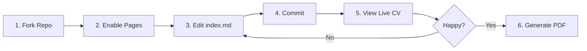
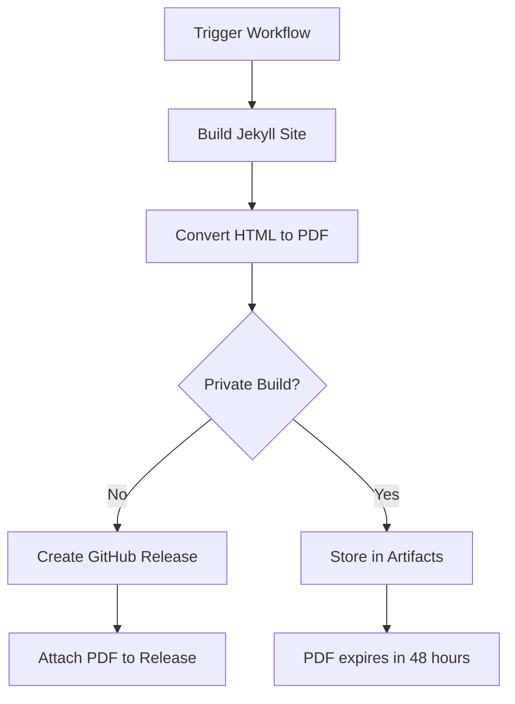

# 📄 Markdown-based CV Generator

[](https://github.com/doctor500/cv/actions/workflows/pages/pages-build-deployment)
[](https://github.com/doctor500/cv/actions/workflows/publish-pdf.yml)

**A professional CV generator using Markdown + Jekyll + GitHub Pages with automated PDF pipeline.**

> [!TIP]
> **Live Demo:** Check out the example at [doctor500.github.io/cv](https://doctor500.github.io/cv)

---

## 📚 Table of Contents

- [Overview](#-overview)
- [Quick Start](#-quick-start)
- [Local Development](#-local-development)
- [Customization](#-customization)
- [PDF Generation Pipeline](#-pdf-generation-pipeline)
- [Governance & Git Workflow](#%EF%B8%8F-governance--git-workflow)
- [AI Agent Workflows](#-ai-agent-workflows)
- [Contributing](#-contributing)
- [License](#-license)

---

## 👋 Overview

Create and maintain your professional CV using simple Markdown, with beautiful templates and automated PDF generation. Inspired by [elipapa's markdown-cv](https://github.com/elipapa/markdown-cv).

### Why This Project?

| Traditional CV | This Project ✨ |
|----------------|-----------------|
| Word/PDF editing | Simple Markdown editing |
| Manual styling & formatting | Multiple professional templates |
| Manual PDF creation | Automated PDF pipeline |
| Hard to version control | Git-integrated workflow |
| Static hosting required | Free GitHub Pages hosting |

### ✨ Key Features

- ✍️ **Markdown-based editing** - Write your CV in simple, readable markdown
- 🎨 **Multiple templates** - Professional designs (kjhealy, davewhipp, doctor-originale-1) ready to use
- 📄 **Automated PDF generation** - GitHub Actions pipeline creates PDFs automatically
- 🚀 **GitHub Pages deployment** - Your CV goes live at `username.github.io/cv`
- 🐳 **Docker-based development** - Preview changes locally with zero setup
- 🔒 **Private build option** - Generate PDFs with sensitive data (phone numbers)
- 🔄 **Auto-reload preview** - See changes instantly during development
- 🤖 **AI agent workflows** - Pre-built automation for CV updates and template creation

---

## 🚀 Quick Start

Get your CV live in **under 10 minutes**!

### Prerequisites

- ✅ GitHub account
- ✅ Git installed locally (optional, for local development)
- ✅ Docker installed (optional, for local preview)

### Step-by-Step Setup



#### 1️⃣ Fork This Repository

Click the **Fork** button at the top of this page to create your own copy.

#### 2️⃣ Enable GitHub Pages

1. Go to your fork's **Settings** → **Pages**
2. Under **Source**, select branch: `main` (or create a `gh-pages` branch)
3. Click **Save**
4. Wait 1-2 minutes for deployment

> [!IMPORTANT]
> **For fork users:** You own your repository, so you can commit directly to `main` or any branch you choose. No need for feature branches unless you prefer that workflow.

#### 3️⃣ Edit Your CV Content

1. Navigate to [`index.md`](./index.md) in your fork
2. Click the pencil icon (✏️) to edit
3. Replace the content with your own information
4. Follow the existing markdown structure for best results

#### 4️⃣ Commit Your Changes

1. Scroll to the bottom of the edit page
2. Add a commit message (e.g., "Update CV with my information")
3. Click **Commit changes**

#### 5️⃣ View Your Live CV

- **URL:** `https://[your-username].github.io/[repo-name]`
- **Example:** `https://doctor500.github.io/cv`
- **Wait time:** 1-2 minutes after commit

> [!TIP]
> Bookmark your CV URL! It updates automatically every time you commit changes to your branch.

#### ✅ Verify Success

- Visit your GitHub Pages URL
- Your CV should display with the default template
- Try editing `index.md` again and watch it update

### What's Next?

- 🎨 [Customize your template](#-customization) for different styling
- 💻 [Set up local development](#-local-development) to preview before publishing
- 📄 [Generate a PDF](#-pdf-generation-pipeline) for job applications

---

## 💻 Local Development

Preview your CV locally before publishing changes to GitHub Pages.

### Choose Your Setup

| Method | Best For | Pros | Cons |
|--------|---------|------|------|
| **Docker** 🐳 | Beginners, consistent environment | No Ruby setup needed, works anywhere | Requires Docker install (~20s reload) |
| **Ruby Server** 💎 | Ruby developers, faster iteration | Faster reload, native environment | Requires Ruby/Jekyll setup |

---

### Option 1: Docker (Recommended)

> [!TIP]
> **Choose Docker if:** You want the easiest setup, don't have Ruby installed, or want a consistent environment across machines.

**Requirements:** Docker Desktop installed ([Download here](https://www.docker.com/products/docker-desktop))

```bash
# Start Jekyll server
docker-compose up -d

# Verify it's running
curl http://localhost:4000

# Access in browser
open http://localhost:4000  # macOS
# or visit http://localhost:4000 in your browser

# Stop server when done
docker-compose down
```

**Customize the Port:**

Edit `docker-compose.yml` if port 4000 is already in use:

```yaml
services:
  jekyll:
    ports:
      - '4077:4000'  # Change 4077 to your preferred port
```

---

### Option 2: Ruby Server (Alternative)

> [!TIP]
> **Choose Ruby if:** You're already a Ruby developer, want faster reload times, or prefer native tooling.

**Requirements:** Ruby 2.7+ and Bundler installed

```bash
# Install dependencies (first time only)
bundle install

# Start Jekyll server
bundle exec jekyll serve

# Access in browser
open http://localhost:4000

# Stop with Ctrl+C
```

---

### Development Workflow

1. **Make changes** to `index.md` or CSS templates
2. **Wait for auto-reload** (~20s for Docker, ~5s for Ruby)
3. **Refresh browser** to see changes
4. **Repeat** until satisfied

> [!WARNING]
> **Config changes require restart:** If you edit `_config.yml`, stop and restart your server. Markdown file changes auto-reload.

### Common Issues & Troubleshooting

<details>
<summary><strong>Port 4000 already in use</strong></summary>

**Error:** `Address already in use - bind(2) for 127.0.0.1:4000`

**Solution:** Either stop the process using port 4000, or change the port in `docker-compose.yml`

```bash
# Find what's using port 4000
lsof -i :4000

# Kill the process (replace PID with actual process ID)
kill -9 PID
```
</details>

<details>
<summary><strong>Docker permission denied</strong></summary>

**Error:** `permission denied while trying to connect to the Docker daemon socket`

**Solution:** Add your user to the docker group or run with sudo

```bash
# Add user to docker group (then log out and back in)
sudo usermod -aG docker $USER
```
</details>

<details>
<summary><strong>Changes not showing up</strong></summary>

**Solution:** 
1. Wait the full reload time (~20s for Docker)
2. Hard refresh your browser (Ctrl+Shift+R or Cmd+Shift+R)
3. Check the terminal for build errors
4. If editing `_config.yml`, restart the server
</details>

---

## 🎨 Customization

### Editing CV Content

Your CV content lives in **[`index.md`](./index.md)** - this is the single source of truth.

**Main sections** (in order):
1. **Header** - Name, title, contact information
2. **Profile Summary** - Professional overview
3. **Technical Skills** - Technologies and tools
4. **Professional Experience** - Work history (reverse chronological)
5. **Education** - Academic background
6. **Activities** - Publications, certifications, projects
7. **Languages** - Language proficiency

> [!TIP]
> **Pro tip:** Use the `/add-cv-section` custom command (if you have the `.agent/workflows` setup) to interactively add new sections with proper formatting!

---

### Changing Templates

Available templates in `media/` directory:

| Template | Style | Best For |
|----------|-------|----------|
| **kjhealy** (default) | Classic two-column, minimalist academic style | Academic, Research, Traditional |
| **davewhipp** | Modern two-column with warm accents | Professional, Corporate, Balanced |
| **doctor-originale-0** | Clean single-column, print-optimized | Tech, ATS-friendly, PDF-focused |
| **doctor-originale-1** | Modern single-column with blue theme (print same as -0) | Tech, Startups, Web-first |

> [!NOTE]
> **doctor-originale series**: All variants share the same print template for consistent PDF output. Differences are in web view styling only.

**To switch templates:**

1. Edit [`_config.yml`](file:///mnt/c/workspace/ai-workspace/cv/_config.yml)
2. Change the `style` value:

```yaml
markdown: kramdown
style: davewhipp  # Options: kjhealy, davewhipp, doctor-originale-1
```

3. Restart your local server to see changes
4. Commit when satisfied

**Each template includes:**
- `[template]-screen.css` - For web display
- `[template]-print.css` - For PDF generation

> [!TIP]
> **Want a custom template?** Use the `/generate-template` workflow (if available) or create your own CSS files following the naming convention above.

---

### Advanced Configuration

**Jekyll Configuration** (`_config.yml`):
- `markdown: kramdown` - Markdown engine (don't change unless you know what you're doing)
- `style: kjhealy` - Template name (matches files in `media/` folder)

**Layout Template** (`_layouts/cv.html`):
- Defines HTML structure
- Injects CSS based on `style` setting
- Renders markdown content from `index.md`

**Adding custom sections** to `index.md`:
```markdown
## New Section Name

`DateRange`
__Position/Title__, Organization

Description of what you did

- Achievement 1 with **metrics** in bold
- Achievement 2
```

---

## 📄 PDF Generation Pipeline

Automatically generate professional PDFs from your CV using GitHub Actions.

### How It Works



### 📋 First-Time Setup

**Enable GitHub Actions** (if not already enabled):

1. Go to your fork's **Settings** → **Actions** → **General**
2. Under **Actions permissions**, select **Allow all actions and reusable workflows**
3. Click **Save**

### 🚀 Generate a PDF

1. Go to **Actions** tab in your repository
2. Click **Build PDF** workflow on the left
3. Click **Run workflow** button (top right)
4. Fill in the form:
   - **Release notes:** Brief description (e.g., "January 2025 update")
   - **Build privately:** ☐ Leave unchecked for public release
5. Click **Run workflow**
6. Wait 2-3 minutes for completion

### 📥 Download Your PDF

**For Public Builds:**
1. Go to **Releases** (right sidebar on repo homepage)
2. Find the latest release (tagged `PDF_YYYYMMDD-timestamp`)
3. Download the PDF file under **Assets**

**For Private Builds:**
1. Go to **Actions** → **Build PDF** → Your workflow run
2. Scroll to **Artifacts** section at the bottom
3. Download the PDF artifact (expires after 48 hours)

---

### 🔒 Private Builds with Sensitive Data

Generate PDFs that include your phone number without publishing it publicly.

> [!IMPORTANT]
> **Use case:** You want to include contact details in the PDF for job applications, but keep them private from your public GitHub Pages CV.

#### Setup (One-Time)

1. Go to **Settings** → **Secrets and variables** → **Actions**
2. Click **New repository secret**
3. Name: `CV_PHONE_NUMBER`
4. Secret: Your phone number (e.g., `+1 (555) 123-4567`)
5. Click **Add secret**

#### Generate Private PDF

1. Follow the normal PDF generation steps above
2. **Check the box:** ✅ **Build privately & include sensitive data**
3. Run workflow
4. PDF will appear in **Artifacts** (not in Releases)

> [!WARNING]
> **Artifact retention:** PDFs in artifacts are automatically deleted after 48 hours. Download them promptly!

---

> [!NOTE]
> **Understanding Releases:** Public builds create a GitHub Release tagged `PDF_YYYYMMDD-HHMMSS` with the PDF attached. This gives you a permanent, versioned history of CV snapshots.

## 🏛️ Governance & Git Workflow

### Governance

**Approval Mode** is active by default for all AI agents working on this repository.

- **Goal:** Ensure safety and alignment through explicit planning and user approval.
- **Protocol:** Agents must propose a plan and receive a "Yes/Proceed" from the user *before* executing any code changes or commands.
- **Details:** See [docs/governance.md](./docs/governance.md) for full protocols and Auto Pilot opt-in options.

### For Core Team: Git Workflow

> [!NOTE]
> **Fork users can skip this subsection!** This is only for core contributors to the original `doctor500/cv` repository.

**Protected branches:** `main` (primary development) and `page-release` (GitHub Pages deployment).

**Never commit directly to protected branches!** Always use feature branches and pull requests.

**Recommended process:**
1. Use the `/git-branch-pr` workflow to create a feature branch
2. Make changes, commit, push
3. Create/update a pull request
4. Merge PR after review

For details, see [`.agent/workflows/git-branch-pr.md`](./.agent/workflows/git-branch-pr.md).

---

## 🤖 AI Agent Workflows

This repository includes pre-built workflows in `.agent/workflows/` designed for any AI agent (Gemini, Claude, ChatGPT, etc.) to help you manage your CV more efficiently.

> [!TIP]
> **Fork users:** The `.agent/` folder is included when you fork! Any AI agent with file system access can use these workflows.

### Available Workflows

| Command | Purpose | Key Features |
|---------|---------|-------------|
| `/add-cv-section` | Add sections to `index.md` | Manual entry or LinkedIn fetch, auto-formatting, validation |
| `/generate-template` | Create CSS templates | URL or description based, screen + print CSS, auto-testing |
| `/build-cv-wizard` | Build CV from data sources | Multi-source gathering, 3-tier URL fallback, render testing |
| `/evaluate-cv-quick` | Quick CV scoring & critique | 6-category scoring, ~2K-4K tokens, fast iteration cycles |
| `/evaluate-cv-deepdive` | Comprehensive CV evaluation | 10 mandatory insight standards, evidence citations, rewrite examples, HTML dashboard |
| `/git-branch-pr` | Git branch & PR management | Feature branches, PR automation, protected branch enforcement |

### Reference Documents

| File | Used By | Content |
|------|---------|--------|
| [`cv-construction-guide.md`](./.agent/references/cv-construction-guide.md) | `/build-cv-wizard` | Writing best practices, ATS tips |
| [`cv-evaluation-framework.md`](./.agent/references/cv-evaluation-framework.md) | `/evaluate-cv-quick`, `/evaluate-cv-deepdive` | 6-category scoring rubric, 10 insight quality standards |
| [`benchmark-testing-framework.md`](./.agent/references/benchmark-testing-framework.md) | `/evaluate-cv-deepdive` | Benchmark testing criteria and validation patterns |

### Technical Documentation

- **[`.agent/README.md`](./.agent/README.md)** — Full workflow documentation and usage details
- **[`.agent/PROJECT_CONTEXT.md`](./.agent/PROJECT_CONTEXT.md)** — Complete technical architecture
- **[`.agent/QUICK_REFERENCE.md`](./.agent/QUICK_REFERENCE.md)** — Quick command reference

<details>
<summary><strong>💬 Example Interactions</strong></summary>

**Adding a new job:**
```
You: "Add my new position at TechCorp as Senior Engineer"
AI: *Reads /add-cv-section workflow*
AI: "I'll help you add that! What's the start date?"
... (continues through workflow)
```

**Creating a custom template:**
```
You: "I want a minimalist template inspired by this design: [URL]"
AI: *Reads /generate-template workflow*
AI: "I'll create a custom template based on that design..."
... (generates CSS files, tests, and updates config)
```
</details>

---

## 💘 Contributing

I believe this project can always improve! Contributions are welcome and appreciated.

### 🎯 Ways to Contribute

- **🎨 New Templates:** Create beautiful CSS templates and share them
- **🔧 Pipeline Features:** Improve the PDF generation workflow
- **📝 Documentation:** Fix typos, clarify instructions, add examples
- **🐛 Bug Fixes:** Report or fix issues you encounter
- **✨ Feature Ideas:** Propose new features via issues

### 📋 Contribution Process

1. **Fork** this repository
2. **Create a feature branch:** `git checkout -b feat/amazing-template`
3. **Make your changes** and test thoroughly
4. **Commit:** `git commit -m "Add amazing new template"`
5. **Push:** `git push origin feat/amazing-template`
6. **Create a Pull Request** with clear description

### 📖 Before Contributing

- Check [`.agent/PROJECT_CONTEXT.md`](./.agent/PROJECT_CONTEXT.md) for technical details
- Review existing templates in `media/` for style guidelines
- Test your changes locally before submitting

---

## 🪪 License

This project is licensed under the [MIT License](./LICENSE).

---

## 📚 Additional Resources

- **Original Inspiration:** [elipapa/markdown-cv](https://github.com/elipapa/markdown-cv)
- **Jekyll Documentation:** [jekyllrb.com](https://jekyllrb.com/)
- **GitHub Pages Guide:** [docs.github.com/pages](https://docs.github.com/en/pages)
- **Markdown Guide:** [markdownguide.org](https://www.markdownguide.org/)
- **Kramdown Syntax:** [kramdown.gettalong.org](https://kramdown.gettalong.org/)

---

**Made with ❤️ by [David Layardi](https://github.com/doctor500)**
