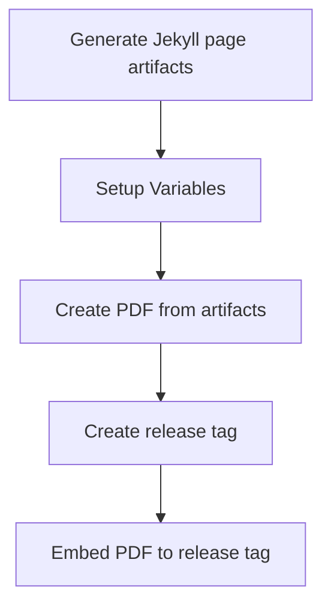

# 📄 Markdown-based CV

[](https://github.com/doctor500/cv/actions/workflows/pages/pages-build-deployment)
[](https://github.com/doctor500/cv/actions/workflows/publish-pdf.yml)

## 👋 Overview
Special thanks to [elipapa's project](https://github.com/elipapa/markdown-cv) as my inspiration and references. This CV is using Jekyll-based page and rendered by the GitHub page pipeline. Features:
1. Customizable templates 🎨
2. Pre-build Pipeline for generating PDF files 📄
3. Pre-build docker-compose 🐳

### Quickstart
1. Fork this repository
2. [Enable GitHub page on your repo](https://docs.github.com/en/pages/getting-started-with-github-pages/creating-a-github-pages-site#creating-your-site)
3. Edit `index.md` content
4. Commit, see the result on `https://[your-username].github.io/[repo-name]`

## 🎨 Customization & Development

You can use this repo to start creating your markdown-based CV.
### 1️⃣ Create your own CV now!
You can start to fork this repo and directly edit the `index.md` content. to name it available online, you can enable GitHub pages on **Settings > Pages**. on the **Branch** section, choose the `main` branch and `Save` it. The GitHub pages will deploy your site to `https://[your-username].github.io/[repo-name]`

### 2️⃣ (Optional) Customize CV templates
There are several templates available that will be added soon to this repo, you can take a look at `./media/`.
It has naming format `[template_name]-print.css` and `[template_name]-screen.css`. You can edit `_config.yml`, and edit the `style: ...` value to `template_name` you want to use.

### 3️⃣ (Optional) Local Jekyll Render
If you want to preview the results first before commiting to the repo, you can installing Jekyll in your local env. Please refer to [Jekyll](https://jekyllrb.com/) official website about how to install Jekyll locally. 

If you have docker installed, you can utilize `docker-compose.yml` that is already created here.

Clone this repo to your local. Use the terminal/command prompt, change the current directory to this repo, and type the following command:
```Shell
docker-compose up -d
```

It will create use port `4000` by default. You can customize the port by editing the `docker-compose.yml` file. For example, if you want to change `4000` to `4077` change the port section to:
```YAML
...
    ports:
      - '4077:4000'
...
```
Jekyll will automatically update the content based on the md file state, it has a refresh period time (on my testing it will be around the 20s). So you don't have to re-create the container to update the page render. But, if you edit `_config.yml` you can re-up the container by retyping the command above

To clean up the container, you can type the following command:
```Shell
docker-compose down
```

## 🤖 Pipeline Feature
### Pipeline for generating the PDF file
Workflow:

To enable generate PDF feature, you can enable the GitHub action integration after you fork this repo. 

## 💘 Contributing
I believe this project still far from stable/good, so I also looking for better improvement. You can submit about new templates, new pipeline feature, refactor, etc. by creating Pull Request (PR) to this repo

## 🪪 License
MIT License

Copyright (c) [David Layardi david@layardi.com]

Permission is hereby granted, free of charge, to any person obtaining a copy of this software and associated documentation files (the "Software"), to deal in the Software without restriction, including without limitation the rights to use, copy, modify, merge, publish, distribute, sublicense, and/or sell copies of the Software, and to permit persons to whom the Software is furnished to do so, subject to the following conditions:

The above copyright notice and this permission notice shall be included in all copies or substantial portions of the Software.

THE SOFTWARE IS PROVIDED "AS IS", WITHOUT WARRANTY OF ANY KIND, EXPRESS OR IMPLIED, INCLUDING BUT NOT LIMITED TO THE WARRANTIES OF MERCHANTABILITY, FITNESS FOR A PARTICULAR PURPOSE AND NONINFRINGEMENT. IN NO EVENT SHALL THE AUTHORS OR COPYRIGHT HOLDERS BE LIABLE FOR ANY CLAIM, DAMAGES OR OTHER LIABILITY, WHETHER IN AN ACTION OF CONTRACT, TORT OR OTHERWISE, ARISING FROM, OUT OF OR IN CONNECTION WITH THE SOFTWARE OR THE USE OR OTHER DEALINGS IN THE SOFTWARE.
