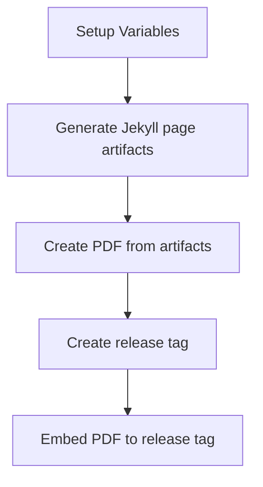

# 📄 Markdown-based CV

[](https://github.com/doctor500/cv/actions/workflows/pages/pages-build-deployment)
[](https://github.com/doctor500/cv/actions/workflows/publish-pdf.yml)

## ℹ️ Quick Overview
Special thanks to [elipapa's project](https://github.com/elipapa/markdown-cv) as my inspiration and reference. This CV is using Jekyll-based page and renders by the GitHub page pipeline. Features:
- Customizeable templates
- Pre-build Pipeline for generate PDF files
- Pre-build docker-compose

## 🤖 Pipeline Flow

### Generate PDF

To enable generate PDF feature, you can enable github action after you fork this repo. Please note that this pipeline have schedule to run every month. You can disable this schedule by edit `.github/workflows/publish-pdf.yml` file, delete this line :
```
...
  schedule:
    - cron: '0 0 1 * *'
...
```

## 🎨 Customization & Development

You can use this repo to start create your own markdown-based CV.
### Create your own CV
You can start fork this repo and directly edit `index.md` content.

Enable it on **Settings > Pages**. on **Branch** section, choose `main` branch and `Save` it. The github pages will deploy your site to `https://[your-username].github.io/[repo-name]`

### Customize CV templates
There are several templates available that will be added more soon to this repo, you can take a look on `./media/`.
It has naming format `[template_name]-print.css` and `[template_name]-screen.css`. You can edit `_config.yml`, and edit `style: ...` value to `template_name` you want to use.

### Local Development
You can refer to [jekyll](https://jekyllrb.com/) official website for install jekyll locally. If you have docker installed, you can utilize `docker-compose.yml` that already created here.


Clone this repo to your local. Use terminal/command prompt, change the current directory to this repo and type the following command:
```
docker-compose up -d
```

It will create use port `4000` by default. You can customize the port by editing `docker-compose.yml` file. For example, if you want to change `4000` to `4077` change the port section to:
```
...
    ports:
      - '4077:4000'
...
```
Jekyll will automatically update the content based on md file state, it has refresh period time (on my testing it will around 20s). So you don't have to re-create the container to update the page render.

To cleanup the container, you can type the following command:
```
docker-compose down
```