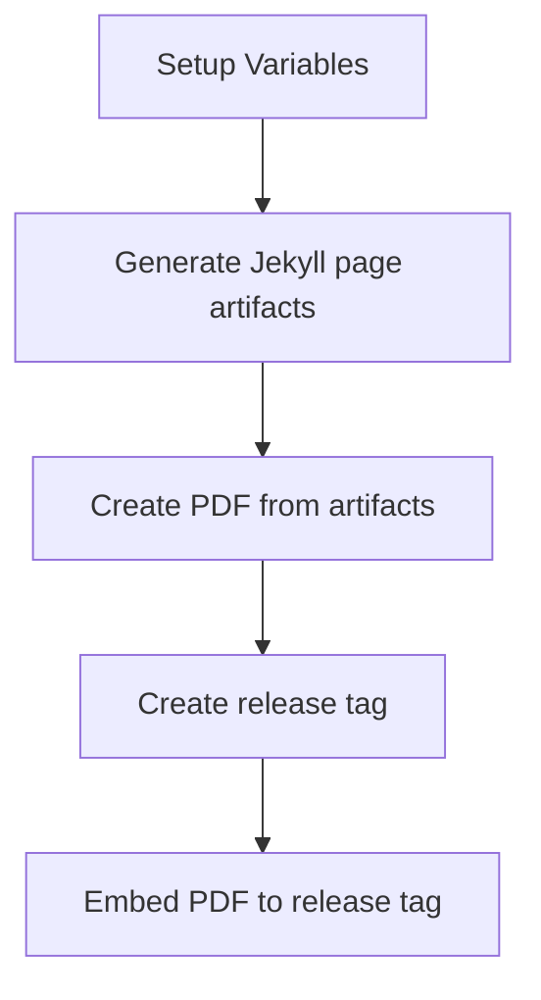

# 📄 Markdown-based CV

[](https://github.com/doctor500/cv/actions/workflows/pages/pages-build-deployment)
[](https://github.com/doctor500/cv/actions/workflows/publish-pdf.yml)

## ℹ️ Quick Overview
Special thanks to [elipapa's project](https://github.com/elipapa/markdown-cv) as my inspiration and reference. This CV is using Jekyll-based page and renders by the GitHub page pipeline. Features:
1. Customizable templates 🎨
2. Pre-build Pipeline for generating PDF files 📄
3. Pre-build docker-compose 🐳

## 🤖 Pipeline Overview

### Pipeline for generating the PDF file
Workflow:

To enable generate PDF feature, you can enable the GitHub action integration after you fork this repo. Please note that this pipeline has scheduled to run every month. You can disable this schedule by editing the `.github/workflows/publish-pdf.yml` file, and removing this part :
```
...
  schedule:
    - cron: '0 0 1 * *'
...
```

## 🎨 Customization & Development

You can use this repo to start creating your markdown-based CV.
### 1️⃣ Create your own CV now!
You can start to fork this repo and directly edit the `index.md` content. to name it available online, you can enable GitHub pages on **Settings > Pages**. on the **Branch** section, choose the `main` branch and `Save` it. The GitHub pages will deploy your site to `https://[your-username].github.io/[repo-name]`

### 2️⃣ Customize CV templates
There are several templates available that will be added soon to this repo, you can take a look at `./media/`.
It has naming format `[template_name]-print.css` and `[template_name]-screen.css`. You can edit `_config.yml`, and edit the `style: ...` value to `template_name` you want to use.

### 3️⃣ Local Development
You can refer to [Jekyll](https://jekyllrb.com/) official website to install Jekyll locally. If you have docker installed, you can utilize `docker-compose.yml` that is already created here.


Clone this repo to your local. Use the terminal/command prompt, change the current directory to this repo, and type the following command:
```
docker-compose up -d
```

It will create use port `4000` by default. You can customize the port by editing the `docker-compose.yml` file. For example, if you want to change `4000` to `4077` change the port section to:
```
...
    ports:
      - '4077:4000'
...
```
Jekyll will automatically update the content based on the md file state, it has a refresh period time (on my testing it will be around the 20s). So you don't have to re-create the container to update the page render. But, if you edit `_config.yml` you can re-up the container by retyping the command above

To clean up the container, you can type the following command:
```
docker-compose down
```