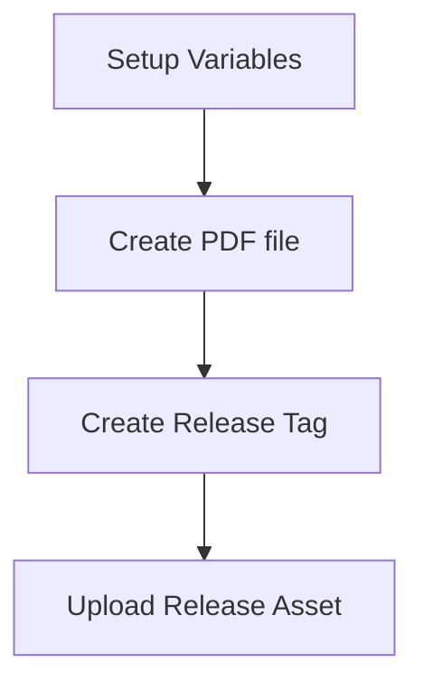

# Markdown-based CV

Special thanks to [elipapa's project](https://github.com/elipapa/markdown-cv) as my inspiration and reference.

## Quick Overview
This CV is using Jekyll-based page and renders by the GitHub page pipeline.

## Pipeline Flow

### Generate PDF
